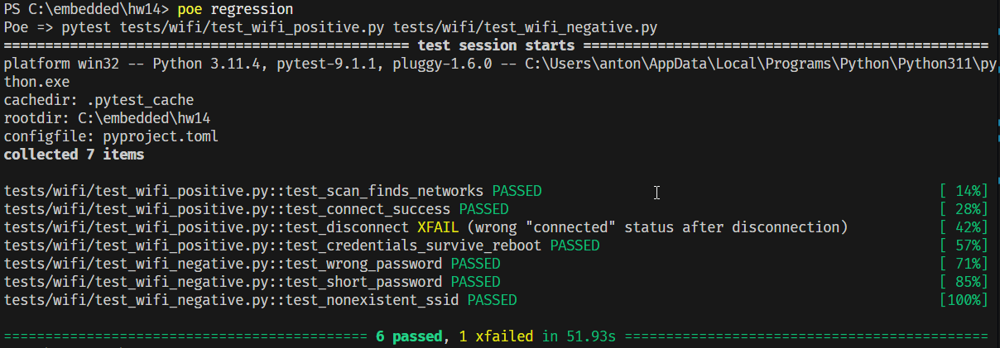
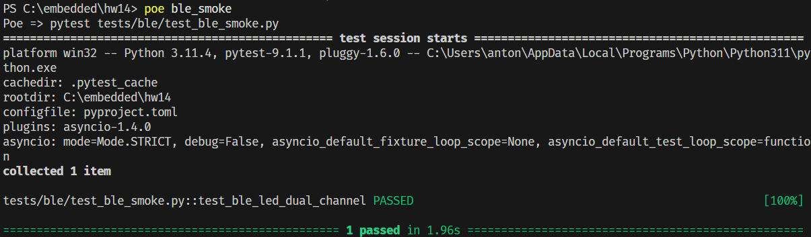
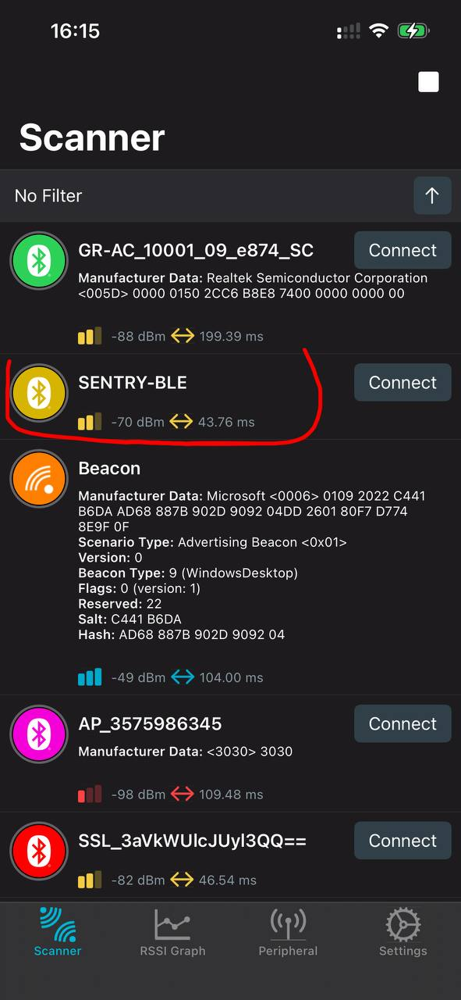
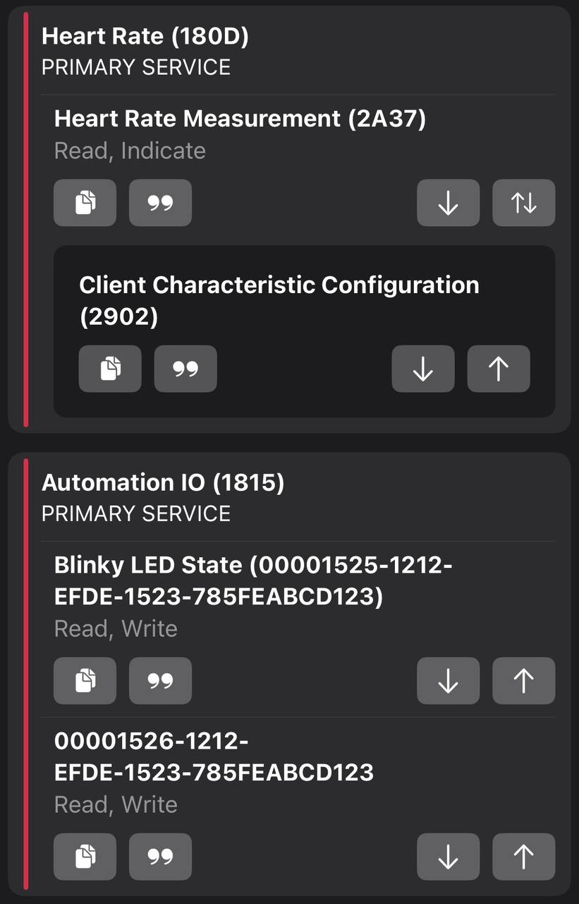
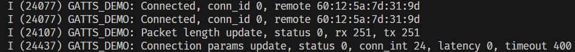
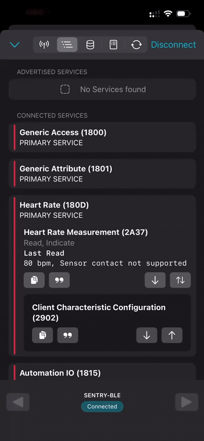
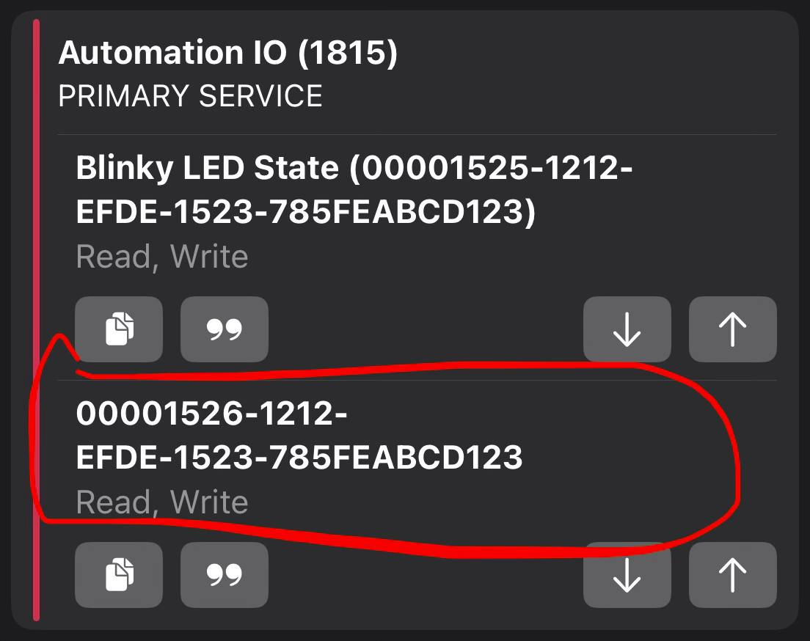

# Test Report

## 1. WiFi Automated Tests

### Environment Variables

WiFi credentials used by the tests are configured through environment variables:

- `SSID` — WiFi network name.
- `PASSWORD` — WiFi network password.

The framework loads these variables from a `.env` file in the project root using `python-dotenv`.

Create a `.env` file in the project root:

```env
SSID=your_wifi_ssid
PASSWORD=your_wifi_password
```

The `.env` file is excluded from Git through `.gitignore`, so WiFi credentials are not committed to the repository.

Alternatively, the variables can be set for the current PowerShell session:

```powershell
$env:SSID="your_wifi_ssid"
$env:PASSWORD="your_wifi_password"
```

### Running Tests

Run the complete WiFi regression suite:

```powershell
poe regression
```

Positive tests only:

```powershell
poe positive_tests
```

Negative tests only:

```powershell
poe negative_tests
```

### Test Run Screenshot



---

## 2. BLE Testing

### 2.1 BLE Smoke Automated Test

The BLE smoke test verifies the complete BLE control path using two observation channels:

1. `BleakScanner` discovers the `SENTRY-BLE` device.
2. `BleakClient` connects to the device.
3. `0x01` is written to the LED characteristic and `LED ON!` is verified through UART.
4. `0x00` is written to the LED characteristic and `LED OFF!` is verified through UART.
5. The BLE connection is closed after the test.

The LED characteristic UUID is configured through the `LED_CHAR_UUID` environment variable:

```env
LED_CHAR_UUID=...
```

For the current PowerShell session it can be set with:

```powershell
$env:LED_CHAR_UUID="..."
```

Run the BLE smoke test:

```powershell
poe ble_smoke
```

#### BLE Smoke Test Run



### 2.2 Manual Test Run

| # | Test Name | Requirement | Steps | Expected Result | Actual Result | Status | Evidence | Bug Report |
|---|---|---|---|---|---|---|---|---|
| **B1.1** | BLE Advertising and Scan | **FR-A1** | **[Phone / nRF Connect]** Open Scanner.<br>**[Phone]** Start BLE scan.<br>**[Phone]** Find `SENTRY-BLE`.<br>**[Phone]** Record RSSI. | `SENTRY-BLE` is visible in scan results, available for connection, and RSSI is displayed. | `SENTRY-BLE` is visible in scan results, available for connection, and RSSI is displayed. | PASS |  | — |
| **B1.2** | Connect and GATT Discovery | **FR-A1, FR-A3, FR-G1, FR-G3** | **[Phone / nRF Connect]** Connect to `SENTRY-BLE`.<br>**[Phone]** Verify Heart Rate Service `0x180D` with characteristic `0x2A37`.<br>**[Phone]** Verify Automation IO Service `0x1815`.<br>**[Phone]** Verify LED characteristic `00001525-1212-efde-1523-785feabcd123`.<br>**[Phone]** Verify RELAY characteristic `00001526-1212-efde-1523-785feabcd123`.<br>**[UART Terminal]** Check connection log. | Connection succeeds. Required services and characteristics are discovered. UART contains `Connected, conn_id ..., remote <MAC>`. | PASS with issue — both required characteristics are present, but RELAY has no descriptive name. | PASS with flaws | . . | [BUG-003](#bug-003) |
| **B1.3** | Heart Rate Indications | **FR-G1, FR-G2** | **[Phone / nRF Connect]** Open characteristic `0x2A37`.<br>**[Phone]** Enable indications via CCCD.<br>**[Phone]** Observe values for several seconds. | Client receives a new Heart Rate value approximately every second. Values are within **60–80 bpm**. | Heart Rate indications randomly stop updating for one second | FAIL | . | [BUG-004](#bug-004) |
| **B1.4** | Heart Rate Spike | **FR-C3, FR-K1** | **[Phone / nRF Connect]** Keep Heart Rate indications enabled.<br>**[UART Terminal]** Execute `hr spike` *(alternatively [Device] press K1)*.<br>**[Phone]** Observe Heart Rate values for at least 5 seconds. | Heart Rate changes to approximately **190–199 bpm for 5 seconds** and is received by the BLE client. | — | — | nRF Connect screenshot showing spike value. | — |
| **B1.5** | LED Control via BLE | **FR-G3, FR-G4** | **[Phone / nRF Connect]** Write `01` to LED characteristic.<br>**[Device]** Verify LED turns ON.<br>**[UART Terminal]** Verify `LED ON!`.<br>**[Phone]** Write `00`.<br>**[Device]** Verify LED turns OFF.<br>**[UART Terminal]** Verify `LED OFF!`. | `01` turns physical LED ON and logs `LED ON!`. `00` turns LED OFF and logs `LED OFF!`. | — | — | UART log + photo/description of physical LED state. | — |
| **B1.6** | Relay Control via BLE | **FR-G3, FR-G4** | **[Phone / nRF Connect]** Write `01` to RELAY characteristic.<br>**[Device]** Verify relay activates.<br>**[UART Terminal]** Verify `RELAY ON!`.<br>**[Phone]** Write `00`.<br>**[Device]** Verify relay deactivates.<br>**[UART Terminal]** Verify `RELAY OFF!`. | `01` activates physical relay and logs `RELAY ON!`. `00` deactivates relay and logs `RELAY OFF!`. | — | — | UART log + photo/description of physical relay reaction. | — |
| **B1.7** | Read After Write | **FR-G3, FR-G5** | **[Phone / nRF Connect]** Write `01` to LED/RELAY characteristic.<br>**[Phone]** Read the same characteristic and record value.<br>**[Phone]** Write `00`.<br>**[Phone]** Read the characteristic again. | Read after write `01` returns `01`. Read after write `00` returns `00`. | — | — | nRF Connect screenshot showing write/read values. | — |
| **B1.8** | Control Channel State Synchronization | **FR-G5, FR-C1, FR-K2** | **[Phone / nRF Connect]** Write `01` to LED characteristic.<br>**[Device]** Verify LED is ON.<br>**[UART Terminal]** Execute `led off` *(alternatively [Device] press K2 to toggle LED)*.<br>**[Device]** Verify LED turns OFF.<br>**[Phone]** Read LED characteristic. | BLE read returns `00`, reflecting the actual LED state changed through another control channel. | — | — | nRF Connect read result + UART log/physical LED reaction. | — |
| **B1.9** | Disconnect and Reconnect | **FR-A1, FR-A2, FR-A3** | **[Phone / nRF Connect]** Disconnect from `SENTRY-BLE` *(alternatively [UART Terminal] execute `disconnect`)*.<br>**[UART Terminal]** Verify `Disconnected ...` log.<br>**[Phone]** Start BLE scan.<br>**[Phone]** Find `SENTRY-BLE` again without rebooting the device.<br>**[Phone]** Reconnect to `SENTRY-BLE`.<br>**[UART Terminal]** Verify new `Connected, conn_id ..., remote <MAC>` log. | Disconnect is logged. Advertising resumes automatically without reboot. `SENTRY-BLE` becomes discoverable again and reconnection succeeds. | — | — | UART disconnect/connect logs + nRF Connect scan/reconnect screenshot. | — |

### 2.3 Bug Reports

| Bug ID | Summary | Steps | Expected Result | Actual Result | Evidence |
|---|---|---|---|---|---|
| **BUG-001** | WiFi status reports `connected` after successful disconnect | 1. Connect device to WiFi.<br>2. Execute `disconnect`.<br>3. Execute `status`. | `status` reports `WiFi: disconnected`. | Device is disconnected, but `status` incorrectly reports `WiFi: connected`. | `wifi station: disconnected`<br>`wifi station: connect to the AP fail`<br>`WiFi: connected`<br>`SSID:`<br>`IP: 0.0.0.0`<br>`RSSI: 0 dBm` |
| **BUG-002** | Device remains in Download Mode after successful flashing (reproduces for wifi as well as for ble) | 1. Flash firmware using `esptool`.<br>2. Wait for automatic reset.<br>3. Open UART and check device state. | Device automatically boots into the flashed application after flashing. | Device remains in `DOWNLOAD(USB/UART0)` mode and boots only after a physical reset. | `Hash of data verified.`<br>`Hard resetting via RTS pin...`<br>`boot:0x0 (DOWNLOAD(USB/UART0))`<br>`waiting for download` |
| **BUG-003** | RELAY characteristic has no descriptive name in BLE client | **[Phone / nRF Connect]** Connect to `SENTRY-BLE`.<br>Open Automation IO service `0x1815`.<br>Check characteristic `00001526-1212-efde-1523-785feabcd123`. | RELAY characteristic is identifiable by a descriptive name, similar to the LED characteristic. | Only UUID `00001526-1212-EFDE-1523-785FEABCD123` is displayed. No descriptive RELAY name is shown, making its purpose unclear in the UI. |  |
| **BUG-004** | Heart Rate indications randomly stop updating for one second | **[Phone / nRF Connect]** Connect to `SENTRY-BLE`.<br>**[Phone]** Open Heart Rate Measurement `0x2A37`.<br>**[Phone]** Enable indications.<br>**[Phone]** Observe Heart Rate updates for an extended period. | Heart Rate indication is received every second without interruptions. | Heart Rate values are normally updated every second, but at random moments no new indication is received for approximately one second. Updates then continue automatically. | . |

